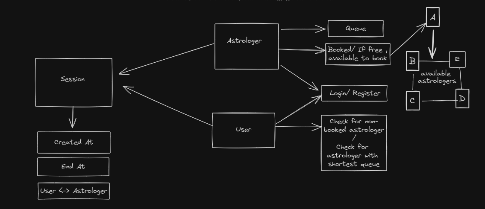

# Flow Distribution Algorithm

The flow distribution algorithm ensures fair distribution of users among astrologers, while allowing adjustment of flow for top astrologers based on user preferences.

**Endpoints:**

## Users Endpoints

This document provides details about the API endpoints provided by the UserRouter module.

### Base URL
The base URL for accessing the endpoints is `/api/users`.

### Endpoints

#### 1. GET `/api/users/`

- **Description**: Retrieves available astrologers sorted by rating.
- **Method**: GET
- **Response**: Returns a list of available astrologers.
- **Response Example**:
  ```json
  {
    "data": [
      {
        "_id": "user",
        "name": "User Name"
      },
      // More users...
    ]
  }
  ```

#### 2. POST `/api/users/register`

- **Description**: Registers a new user.
- **Method**: POST
- **Request Body**:
  ```json
  {
    "name": "User Name",
    "email": "user@example.com",
    "password": "userpassword"
  }
  ```
- **Response**: Returns a message indicating successful registration along with a JWT token.
- **Response Example**:
  ```json
  {
    "message": "User Registered",
    "token": "jwt.token.string",
    "name": "User Name"
  }
  ```

#### 3. POST `/api/users/login`

- **Description**: Logs in an existing user.
- **Method**: POST
- **Request Body**:
  ```json
  {
    "email": "user@example.com",
    "password": "userpassword"
  }
  ```
- **Response**: Returns a message indicating successful login along with a JWT token.
- **Response Example**:
  ```json
  {
    "message": "User Logged In",
    "token": "jwt.token.string",
    "name": "User Name"
  }
  ```

#### 4. POST `/api/users/schedule`

- **Description**: Schedules an appointment with an astrologer.
- **Method**: POST
- **Request Body**:
  ```json
  {
    "userID": "user_id",
    "query": "Appointment query"
  }
  ```
- **Response**: Returns the appointment details.
- **Response Example**:
  ```json
  {
    "appointmentID": "appointment_id",
    "astrologerID": "astrologer_id",
    "userID": "user_id",
    "query": "Appointment query",
    "createdAt": "2022-05-25T10:00:00.000Z"
  }
  ```

### Error Responses

- **400 Bad Request**: Indicates an error in the request body or parameters. The response body contains an error message.
- **500 Internal Server Error**: Indicates an unexpected error occurred on the server. The response body contains an error message.

### Authentication

- JWT (JSON Web Token) is used for user authentication. The token should be included in the Authorization header of each request.

### Security

- Ensure that sensitive information such as passwords is transmitted securely over HTTPS.
- Implement proper validation and sanitization of user input to prevent injection attacks and other security vulnerabilities.

That concludes the documentation for the User API endpoints.

## Astrologer Endpoints

**1. Register Astrologer**

- **URL:** `/register`
- **Method:** `POST`
- **Description:** Registers a new astrologer.
- **Request Body:**
  - `name` (String, required): Name of the astrologer.
  - `email` (String, required): Email of the astrologer.
  - `password` (String, required): Password of the astrologer.
- **Success Response:**
  - **Code:** `200 OK`
  - **Content:** `{ message: "User Registered", token: "JWT token", name: "Astrologer Name" }`
- **Error Response:**
  - **Code:** `400 Bad Request`
  - **Content:** `"User already exist"` or Error message if registration fails.

---

**2. Login Astrologer**

- **URL:** `/login`
- **Method:** `POST`
- **Description:** Logs in an existing astrologer.
- **Request Body:**
  - `email` (String, required): Email of the astrologer.
  - `password` (String, required): Password of the astrologer.
- **Success Response:**
  - **Code:** `200 OK`
  - **Content:** `{ message: "User Logged In", token: "JWT token", name: "Astrologer Name" }`
- **Error Response:**
  - **Code:** `400 Bad Request`
  - **Content:** `"User does not exist"` or Error message if login fails.

---

**3. Edit Astrologer Profile**

- **URL:** `/edit/:id`
- **Method:** `PATCH`
- **Description:** Edits the profile of an existing astrologer.
- **Request Parameters:**
  - `id` (String, required): ID of the astrologer to be edited.
- **Request Body:** Fields to be updated in the astrologer's profile.
- **Success Response:**
  - **Code:** `200 OK`
  - **Content:** Updated astrologer object.
- **Error Response:**
  - **Code:** `400 Bad Request`
  - **Content:** Error message if astrologer is not found.

---

**4. End Session**

- **URL:** `/endSession`
- **Method:** `POST`
- **Description:** Ends an active session for an astrologer.
- **Request Body:**
  - `sessionId` (String, required): ID of the session to be ended.
  - `userID` (String, required): ID of the astrologer.
- **Success Response:**
  - **Code:** `200 OK`
  - **Content:** `{ message: 'Session ended successfully' }`
- **Error Response:**
  - **Code:** `400 Bad Request`
  - **Content:** Error message if session or astrologer is not found.

---

**5. Update Astrologer Flow**

- **URL:** `/flow`
- **Method:** `POST`
- **Description:** Updates the flow of an astrologer.
- **Request Body:**
  - `userID` (String, required): ID of the astrologer.
  - `flow` (Number, required): New flow value for the astrologer.
- **Success Response:**
  - **Code:** `200 OK`
  - **Content:** Updated astrologer object.
- **Error Response:**
  - **Code:** `400 Bad Request`
  - **Content:** Error message if astrologer is not found.

---

**Note:** Replace `"JWT token"` with the actual JWT token generated during registration or login. Ensure to include the token in the Authorization header for authenticated requests.

---

**Cron Job:**

A cron job is scheduled to run daily at midnight (00:00) to update the `remaining` field of all astrologers based on their `flow` values. This ensures accurate tracking of remaining sessions for each astrologer.

---

This documentation provides information about the Astrologer API endpoints and their usage. Make sure to handle authentication and authorization properly to secure the endpoints.


**Flowchart showing all processes:**



**Logic behind setup:**

Here , whenever the user calls `/schedule`, function gets all the astrologers who are not booked. If there are no free astrologers, function will get all astrologers and sort them according to their rating and number of appointments, the astrologer with highest rating and least number of appointments gets appointment . At the mentioned time , session is created and will continue till astrologer ends the session. Once the session is over, the first appointment of astrologer will be removed ,if there are more appointments , next session will be started and if there are not any more appointments, astrologer's booking status will show not booked.

